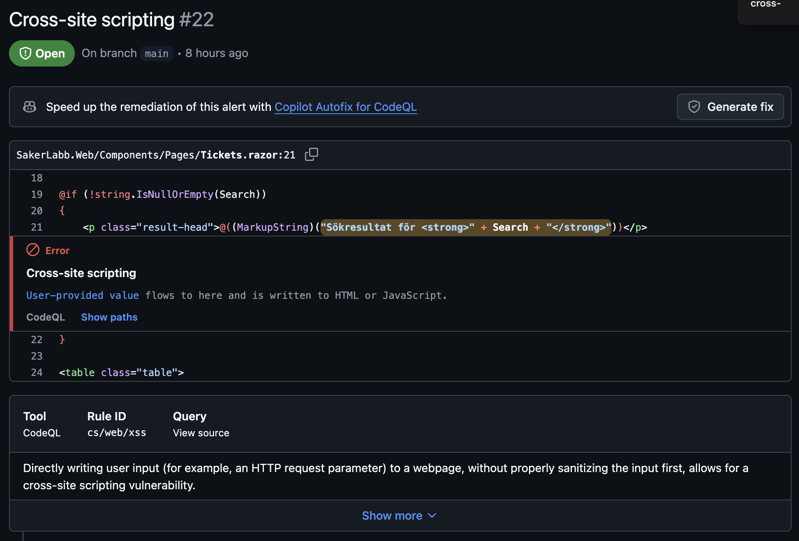
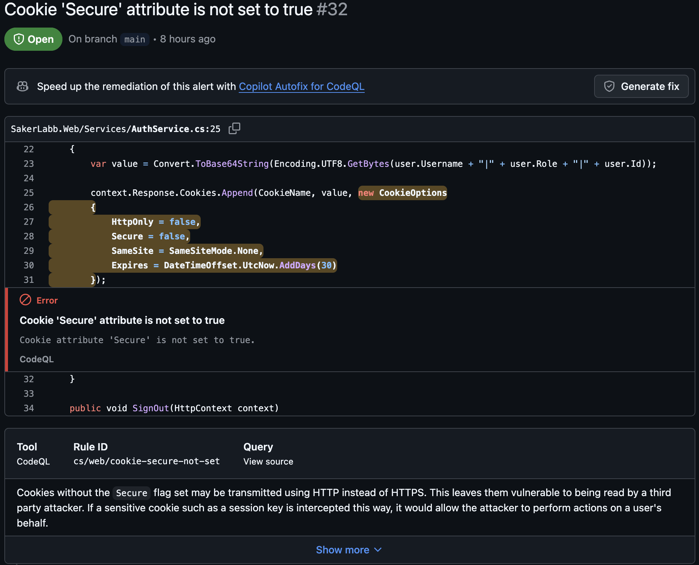
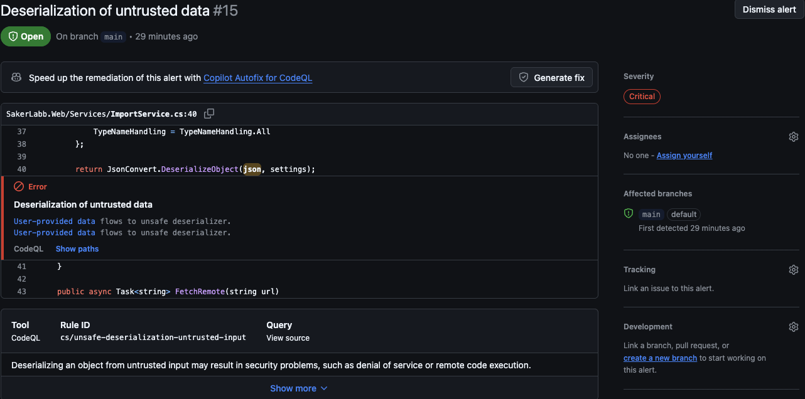
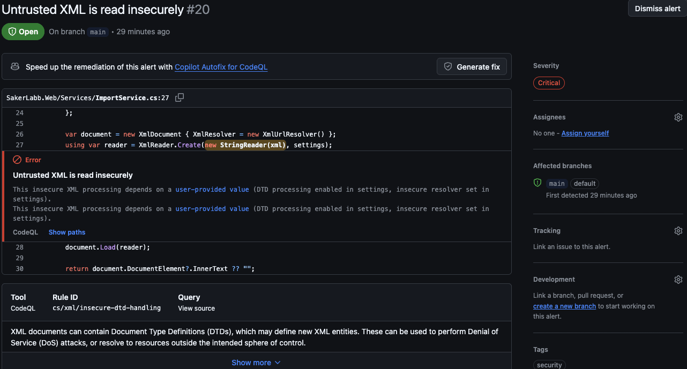
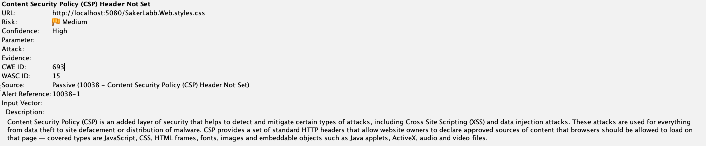
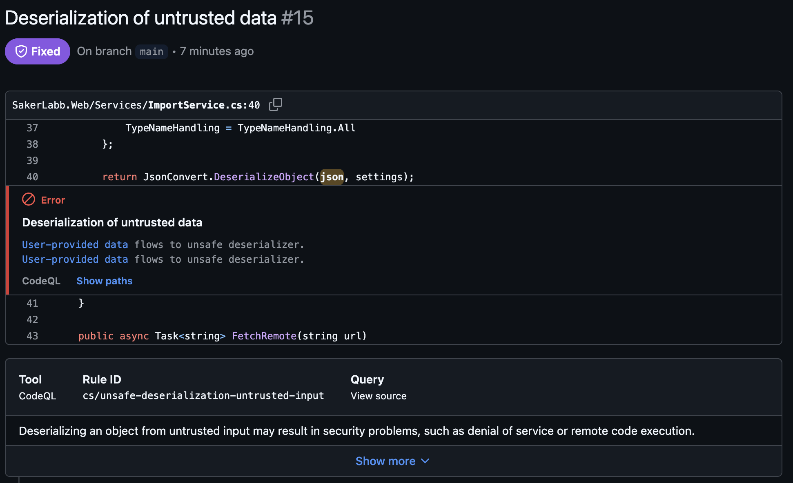
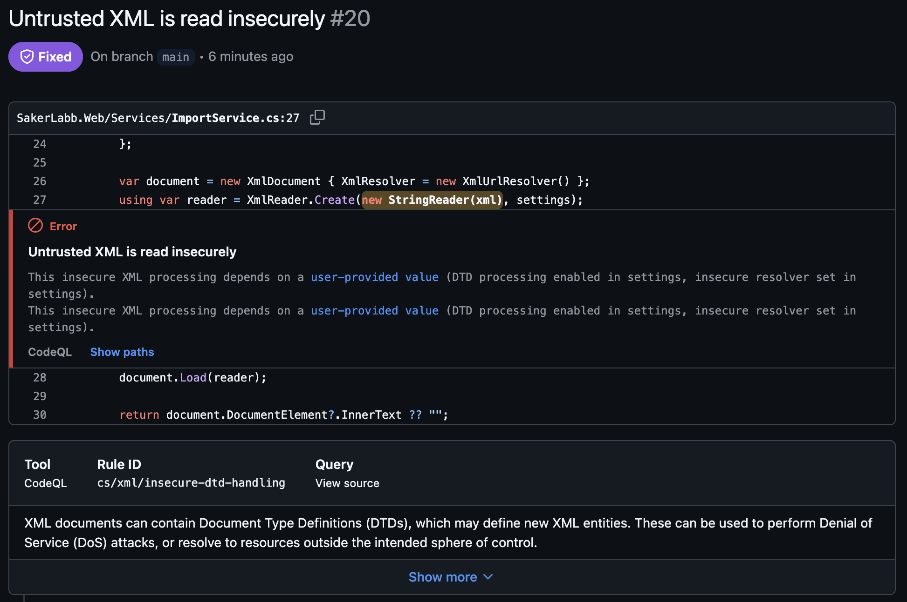
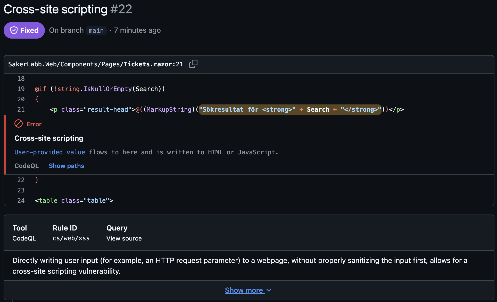

# Labbrapport: praktisk laboration

*Kunskapskontroll 2, IT-säkerhet för utvecklare. Fyll i mallen och lämna in som PDF tillsammans med länken till ditt repo. Riktlängd två till tre sidor.*

**Namn:** Sebastian
**Datum:** 2026-09-01
**Repo (länk till din fork):** https://github.com/sbrindmark/SakerLabb
**Applikation som analyserades:** SakerLabb Support

---

## 1. Kort om applikationen och analysen

Beskriv i några meningar vilken app du analyserade, vad den gör och hur du genomförde analysen. Ange vilka verktyg du använde och hur du körde dem (CodeQL default setup med språk C#, ZAP passiv och aktiv skanning mot vilken adress).

Jag analyserade SakerLabb, ett ärendehanteringssystem. Appen låter kunder skicka in supportärenden som administratörer kan söka i, kommentera och byta status på. Det går att ladda upp bilagor, göra import, diagnostik och hantera administratörer. 

Jag gjorde analysen med både statiskt och dynamisk kodanalys. Den statiska analysen gjorde jag i GitHub med CodeQL och GitHub code scanning med default setup och C# som språk. 
Den dynamiska analysen gjorde jag med OWASP ZAP mot localhost:5080. Jag loggade in i appen och klickade mig runt medan ZAP gjorde en passiv skanning. 

---

## 2. Fem fynd

Fyll i tabellen. Minst ett fynd ska komma från statisk analys (CodeQL) och minst ett från dynamisk analys (ZAP). Spara bevis i form av skärmbild eller rapportutdrag och hänvisa till det per fynd.

| Nr | Källa (CodeQL/ZAP) | Regel-id eller alert | Allvarlighet (+ confidence för ZAP) | Fil och rad eller URL | Verkligt eller falskt positivt | Motivering (2–4 meningar) |
|----|--------------------|----------------------|-------------------------------------|-----------------------|--------------------------------|---------------------------|
| 1 |CodeQL  |cs/web/xss  |High  |SakerLabb.Web/Components/Pages/Tickets.razor:21  |Verkligt  |Skriver ut sökordet oescapat så att skript kan köras i webbläsaren. En angripare kan skicka en länk med skadligt skript som körs hos den som klickar, t.ex. för att stjäla sessionen. Sökordet kommer från användaren och visas rakt av, så fyndet är verkligt.  |
| 2 |CodeQL  |cs/web/cookie-httponly-not-set + cs/web/cookie-secure-not-set  |Medium  |SakerLabb.Web/Services/AuthService.cs:25  |Verkligt  |Inloggningskakan sätts utan flaggorna HttpOnly och Secure. Utan HttpOnly kan skript i webbläsaren läsa kakan, och utan Secure kan den skickas okrypterat. Det gör det lättare för en angripare att komma åt sessionen.  |
| 3 |CodeQL  |cs/unsafe-deserialization-untrusted-input  |Critical  |SakerLabb.Web/Services/ImportService.cs:40  |Verkligt  |Det går att skicka in instruktioner som gör att servern kör koden. Vad som ska göras bestäms i inkommande data istället för i koden. Det betyder att en angripare i praktiken kan ta över servern. Datan tas emot direkt i importen utan kontroll.  |
| 4 |CodeQL  |cs/xml/insecure-dtd-handling  |Critical  |SakerLabb.Web/Services/ImportService.cs:27  |Verkligt  |Appen kan ta emot XML-filer och "lyda" instruktioner. Den borde bara läsa datan. En angripare kan därför få servern att läsa upp lokala filer eller surfa till adresser åt dem. Eftersom XML:en kommer utifrån och läses utan spärr är fyndet verkligt.  |
| 5 |ZAP  |Content Security Policy (CSP) Header Not Set  |Risk: Medium , Confidence: High  |http://localhost:5080/SakerLabb.Web.styles.css  |Verkligt  |Saknar en säkerhetsregel som säger till webbläsaren att endast köra sina egna skript. Det är inget hål i sig, men det tar bort ett skyddsnät och gör XSS-fyndet värre. ZAP bekräftar passivt att headern saknas.  |

Bevis (skärmbilder eller utdrag), numrerade efter fyndet ovan:

**Fynd 1 – cs/web/xss, Tickets.razor:21 (alert #22):**


**Fynd 2 – cs/web/cookie-secure-not-set / cookie-httponly-not-set, AuthService.cs:25 (alert #32):**


**Fynd 3 – cs/unsafe-deserialization-untrusted-input, ImportService.cs:40 (alert #15):**


**Fynd 4 – cs/xml/insecure-dtd-handling, ImportService.cs:27 (alert #20):**


**Fynd 5 – Content Security Policy (CSP) Header Not Set (ZAP, passiv):**


---

## 3. Prioritering

Rangordna fynden och motivera ordningen med allvarlighetsgrad, exponering och utnyttjbarhet. Vilket tar du först och varför?

Fynd 3 – Allvarlighet: högst av alla. Kan ge full kontroll över servern (kodkörning). Exponering: ligger i importfunktionen som tar emot data utifrån. Utnyttjbarhet: en angripare behöver bara skicka in preparerad JSON.

Fynd 4 – Allvarlighet: hög, men konsekvensen är främst filläsning och utgående anrop (SSRF), inte direkt kodkörning. Exponering: samma importväg, tar emot XML utifrån. Utnyttjbarhet: medel, kräver en preparerad XML-fil med extern entitet.

Fynd 1 – Allvarlighet: hög, men drabbar klienten och inte servern. Exponering: publik sökfunktion som är lätt att nå. Utnyttjbarhet: hög, men kräver att ett offer klickar på en preparerad länk.

Fynd 2 – Allvarlighet: medel. Gör det lättare att komma åt sessionen men är ingen egen väg in. Exponering: gäller inloggningskakan för alla användare. Utnyttjbarhet: kräver oftast ett annat fel först, t.ex. XSS eller okrypterad trafik.

Fynd 5 – Allvarlighet: lägst. Inget hål i sig utan ett saknat skyddslager. Exponering: gäller hela appen. Utnyttjbarhet: kan inte utnyttjas i sig men förvärrar XSS-fyndet.


Jag tar Fynd 3 först, eftersom det har den värsta konsekvensen (full kontroll över servern) och den lägsta tröskeln att utnyttja. Det räcker att skicka in preparerad JSON till importen.

---

## 4. Åtgärder (minst tre)

Använd mönstret nedan per åtgärdat fynd. Varje åtgärd ska gå att spåra tillbaka till ett fynd i tabellen ovan, och beviset efter ska vara en **ny körning av verktyget**, inte din egen kod.

### Åtgärd 1

```
Fynd:        3 – cs/unsafe-deserialization-untrusted-input, alert #15
Plats:       SakerLabb.Web/Services/ImportService.cs:40
Bevis före:  proof-3-deserialization.png (alerten står som Open)
Bedömning:   Verkligt. TypeNameHandling.All lät inkommande JSON välja vilken .NET-typ
             som instansierades ($type), vilket möjliggör fjärrkörning av kod (RCE).
Åtgärd:      Bytte TypeNameHandling.All mot TypeNameHandling.None – datan får inte
             längre bestämma typ. Commit b6982e8.
Bevis efter: proof-3-deserialization-fixed.png – CodeQL-körning 33539020206
             (2026-09-01), alert #15 står som Fixed.
```

**Före:**


**Efter:**


### Åtgärd 2

```
Fynd:        4 – cs/xml/insecure-dtd-handling, alert #20
Plats:       SakerLabb.Web/Services/ImportService.cs:27
Bevis före:  proof-4-dtd.png (alerten står som Open)
Bedömning:   Verkligt. DTD-tolkning (DtdProcessing.Parse) i kombination med en
             XmlUrlResolver gör att extern XML kan läsa lokala filer och göra
             utgående anrop (XXE → filläsning och SSRF).
Åtgärd:      Satte DtdProcessing.Prohibit och XmlResolver = null på både
             XmlReaderSettings och XmlDocument. Commit 50b4412.
Bevis efter: proof-4-dtd-fixed.png – CodeQL-körning 33539020206 (2026-09-01),
             alert #20 står som Fixed.
```

**Före:**


**Efter:**


### Åtgärd 3

```
Fynd:        1 – cs/web/xss, alert #22
Plats:       SakerLabb.Web/Components/Pages/Tickets.razor:21
Bevis före:  proof-1-xss.png (alerten står som Open)
Bedömning:   Verkligt. MarkupString skrev sökordet som rå HTML, så ett skript i
             sökparametern kördes i webbläsaren (reflekterad XSS).
Åtgärd:      Tog bort MarkupString och skriver @Search, som Razor HTML-escapar
             automatiskt. <strong> behålls som statisk markup. Commit aded7f3.
Bevis efter: proof-1-xss-fixed.png – CodeQL-körning 33539020206 (2026-09-01),
             alert #22 står som Fixed.
```

**Före:**


**Efter:**


---

## 5. Eventuella bortval

Om du valt att inte åtgärda ett fynd, skriv ned tre saker per bortval: risken, motivet och den kompenserande kontrollen. Sätt gärna ett datum för omprövning.

Jag åtgärdade de tre allvarligaste fynden (1, 3 och 4). Fynd 2 och 5 valde jag att inte åtgärda den här gången. Båda gör andra fel värre men är ingen egen väg in, och XSS-fyndet som gjorde dem farligast är redan fixat.

**Bortval 1 – Fynd 2: cookie utan HttpOnly/Secure**
- Risk: sessionskakan blir lättare att komma åt, t.ex. via skript eller okrypterad trafik.
- Motiv: kräver oftast ett annat fel först, och jag prioriterade de tre fynd som ger kodkörning och XSS. Tiden räckte inte till allt.
- Kompenserande kontroll: XSS är åtgärdat, och appen kördes bara lokalt på localhost i labbmiljön. Det är en liten fix (sätt HttpOnly och Secure till true) som kan tas senare.

**Bortval 2 – Fynd 5: CSP-header saknas**
- Risk: ett extra skydd mot XSS saknas, så om ett XSS-hål kommer tillbaka finns inget som bromsar det.
- Motiv: det är inget hål i sig utan ett skyddslager, och själva XSS-fyndet är redan fixat.
- Kompenserande kontroll: escapingen från Fynd 1 är huvudskyddet mot XSS och den är på plats. En CSP-header kan läggas till senare och verifieras i ZAP.
